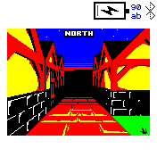
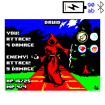
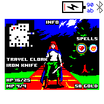

# Heroine Dusk

Heroine Dusk is a basic dungeon crawl made using an old aesthetic.

The game's world is set in a fantasy human realm where the sun has not returned in several days. Evil forces are using the safety of night to invade. You are a serf woman takes up arms to fight against the darkness.

This is the whole demo of the original browser game, from the nightmare in the Serf Quarters to the gates of Stonegate: exploring, chests, resting, fights with random and scripted enemies, the Death Speaker, shops and spells.

Game site: http://heroinedusk.com

## Controls

| Where | Swipe up | Swipe down | Swipe left / right | Tap | Button |
|---|---|---|---|---|---|
| Title | previous item | next item | | choose | back (Options) |
| Exploring | step forward | step back | turn | open Info | open Info |
| Info | | | select a spell | cast it | close |
| Fight | attack | run away | select an action | use it | |
| Victory, defeat | continue | continue | continue | continue | continue |
| Shop, dialog | previous option | next option | | choose | leave |

Heal, Burn and Unlock can be cast from Info: Burn clears bone piles and Unlock opens locked doors next to the heroine.

## Options

On the title screen: animations (the enemy sliding in, shaking when hit), vibration (instead of the original's sound effects) and the minimap while exploring (off by default, like the original; it's always on the Info screen).

## Saving

The game is saved when it matters (changing map, resting, chests, fights, shops, spells) and when you leave the app, and the title offers Continue. The save is `heroine.save.json`, the options `heroine.options.json`; both are removed when the app is uninstalled. There is no "new game" while a save exists, like in the original.

## Differences from the original

- No music; vibration patterns instead of sounds.
- After a defeat any input respawns the heroine at her last resting place (the original waits for the page to be reloaded).
- Colours are reduced to the watch's eight.

## Creator

* Heroine Dusk is created by Clint Bellanger http://clintbellanger.net
* Ported to Bangle.js 2 by Timofey Tipishev https://github.com/tipishev

## License

* The code of the original Heroine Dusk is GPL v3 (or later) and its art is CC-BY-SA 3.0 (or later), both by Clint Bellanger: https://github.com/clintbellanger/heroine-dusk

## Development

- `scripts/generate_bitfont.py`, `scripts/generate_images.py`: convert the original's font and art (see each script)
- `node apps/heroine/scripts/run_emulator_tests.js`: runs all emulator tests, `test.json` (the few that CI runs within its 60 s) and `test_more.json` (needs EspruinoWebIDE next to this repository)
- `PORTING_PLAN.md`: how the port was done
